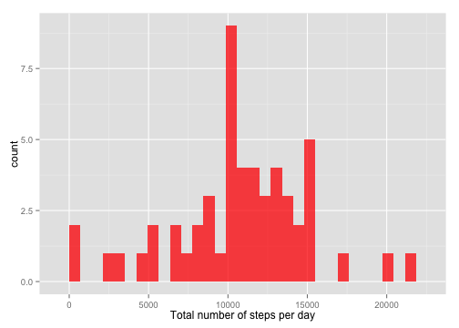

> <span style="color:darkgrey">Observation: Please, note that inline R code is
                             shown within parentheses.</span>

## Loading and preprocessing the data
I start by loading the `knitr`,  `dplyr` and `ggplot2` packages,

```r
# loads required packages
require(knitr)
require(dplyr)
require(ggplot2)
```
and load the data in `activity.csv` into a _tbl_ object called `tbl.activity`
(having previously unzipped the `activity.zip` file if necessary).

```r
# checks if 'activity.csv' is in the working directory; otherwise, gets it from 'activity.zip'
if(!file.exists("activity.csv")) unzip("activity.zip")
# loads the data into tbl.activity
tbl.activity <- tbl_df(read.csv("activity.csv"))
```

## What is the mean total number of steps taken per day?
####Histogram of the total number of steps per day.
I group the data according to the different date, omit missing values, and find
the sum of all steps _per_ date group with `sum()`.  The results are stored in
`sStepsDay`, from which I create a histogram of the total number of steps per
day.

```r
# calculates total number of steps per day
sStepsDay <- group_by(tbl.activity, date) %>%
    na.omit %>%
    summarize(sSteps = sum(steps))
# creates and prints histogram using sStepsDay
hStepsDay <- ggplot(sStepsDay, aes(x = sSteps)) +
             geom_histogram(fill = "red", alpha = .75) +
             xlab("Total number of steps per day")
print(hStepsDay)
```



####Mean and median number of steps per day.
The mean and median number of steps per day are calculated from `sStepsDay`
using `mean()` and `median()`.

```r
# finds the mean and median numbers of steps per day using sStepsDay
meanStepsDay <- mean(sStepsDay$sSteps)
medianStepsDay <- median(sStepsDay$sSteps)
```
The calculated values are:

* **Mean** number of steps per day (``` `r meanStepsDay` ```) is
    10766.19.
* **Median** number of steps per day (``` `r medianStepsDay` ```) is
    10765.


## What is the average daily activity pattern?
#### Time series of the average number of steps taken per 5-minute interval.
The dataset is grouped by time interval, missing values omitted, and the mean
number of steps _per_ interval calculated with `mean()`.  The time series
depicts the variation of the average number of steps per day with respect to the
5-minute time interval.

```r
# calculates mean number of steps per 5-minute interval
mStepsInt <- group_by(tbl.activity, interval) %>%
    na.omit %>%
    summarize(mSteps = mean(steps))
# creates and prints time series plot using mStepsInt
lStepsInt <- ggplot(mStepsInt, aes(x = interval, y = mSteps)) +
             geom_line(color = "blue", size = 1.2, alpha = .75) +
             xlab("Interval") + ylab("Average number of steps per day")
print(lStepsInt)
```


####Interval with the maximum average number of steps.
The figure above shows there is a clear maximun in the mean number of steps
somewhere in the interval [750, 1000].  The exact location of this maximum is
found using `which.max()`, which is then passed as an argument to
`mStepsInt$interval`.

```r
# finds the interval with the maximum average number of steps
maxStepsInt <- mStepsInt$interval[which.max(mStepsInt$mSteps)]
```
The interval with the **maximum** average number of steps is
[830, 835], *i.e.*, 
the (``` `r maxStepsInt/5 + 1` ```) 168-th 5-minute
interval.


## Imputing missing values
#### Total number of missing values in the dataset.
The total number of missing values (`NA`) in the dataset is calculated using
`sum()`, by taking advantage of the way logical factors are represented
internally, _i.e._, `TRUE/FALSE =  1/0`: there are
(``` `r sum(is.na(tbl.activity))` ```) 2304 missing
values.

#### Strategy for filling in the missing values.
I will use a simple strategy to fill in the missing values in the dataset, which
consists in replacing them with the average value for the specific 5-minute
interval _and_ day of the week.

#### Dataset with missing values filled in.
I first calculate the values to replace the `NA` by creating a new object,
`val2fill`, containing the data in `tbl.activity` and an additional column,
`day`, with the day of the week the observation corresponds to (calculated using
`weekdays()`).  The data in `val2fill` is then grouped by interval and day, and
the mean number of steps _per_ group is calculated with `mean()`.

```r
# creates dataset with values to fill in NAs in tbl.activity
val2fill <- mutate(tbl.activity, day = weekdays(as.Date(date))) %>%
    group_by(interval, day) %>%
    summarize(mStepsID = mean(steps, na.rm = TRUE))
```
The strategy devised in the previous section is implemented by looping over
`tbl.activity$steps`,

```r
# loops over tbl.activity$steps replacing missing values with the average number
# of steps for the specific 5-minute interval and day of the week
for(i in 1:length(tbl.activity$steps)) {
    if(is.na(tbl.activity$steps[i])) {
        tbl.activity$steps[i] <-
            val2fill$mStepsID[val2fill$interval == tbl.activity$interval[i] &
                                  val2fill$day == weekdays(as.Date(tbl.activity$date[i]))]
    }
}
```
after which, the dataset has been updated

```r
# prints updated tbl.activity structure
str(tbl.activity)
```

```
## Classes 'tbl_df', 'tbl' and 'data.frame':	17568 obs. of  3 variables:
##  $ steps   : num  1.43 0 0 0 0 ...
##  $ date    : Factor w/ 61 levels "2012-10-01","2012-10-02",..: 1 1 1 1 1 1 1 1 1 1 ...
##  $ interval: int  0 5 10 15 20 25 30 35 40 45 ...
```
and contains (``` `r sum(is.na(tbl.activity))` ```)
0 missing values.

#### Histogram of the total number of steps per day, mean and median.
A new histogram of the total number of steps per day is created using an
analogous algorithm as above,

```r
sStepsDay <- group_by(tbl.activity, date) %>%
    summarize(sSteps = sum(steps))
hStepsDay <- ggplot(sStepsDay, aes(x = sSteps)) +
             geom_histogram(fill = "green3", alpha = .75) +
             xlab("Total number of steps per day")
print(hStepsDay)
```


and new mean and median number of steps per day are additionally determined.

```r
# finds the new mean and median numbers of steps per day
meanStepsDay <- mean(sStepsDay$sSteps)
medianStepsDay <- median(sStepsDay$sSteps)
```
The new **mean** number of steps per day is (``` `r meanStepsDay` ```)
10821.21, while the new **median** is (``` `r medianStepsDay` ```)
11015.

The histogram does _not_ show significant differences from above, while the mean
and median values are _slightly higher_.  These qualitative conclusions will
of course depend on the strategy chosen to fill in the missing values in the
original dataset.


## Are there differences in activity patterns between weekdays and weekends?
### Add factor variable to indicate whether date refers to a weekday or weekend.
A new column, `dayKind`, is added to the updated dataset, which initially
contains the day of the week for each observation calculated using `weekdays()`.
The new column is updated by classifying each day as "weekday" or "weekend"
using `ifelse()`---and converted int a factor,

```r
# adds dayKind column with day of the week
tbl.activity <- mutate(tbl.activity, dayKind = weekdays(as.Date(date)))
# updates dayKind by classifying as weekday or weekend & converts to factor
tbl.activity$dayKind <- ifelse(tbl.activity$dayKind %in% c("Saturday", "Sunday"),
                               "weekend", "weekday")
tbl.activity$dayKind <- as.factor(tbl.activity$dayKind)
```
which results in the desired new structure for the dataset.

```r
# prints updated tbl.activity structure
str(tbl.activity)
```

```
## Classes 'tbl_df', 'tbl' and 'data.frame':	17568 obs. of  4 variables:
##  $ steps   : num  1.43 0 0 0 0 ...
##  $ date    : Factor w/ 61 levels "2012-10-01","2012-10-02",..: 1 1 1 1 1 1 1 1 1 1 ...
##  $ interval: int  0 5 10 15 20 25 30 35 40 45 ...
##  $ dayKind : Factor w/ 2 levels "weekday","weekend": 1 1 1 1 1 1 1 1 1 1 ...
```

#### Panel plot of the 5-minute interval and the average number of steps taken, averaged across all weekday days or weekend days.
The updated dataset is grouped by interval and dayKind, and the average values
for each group is calculated with `mean()`.  A panel plot is created, with the
time series per dayKind and a smoother to highlight the overall qualitative
behavior.

```r
# calculates average number of steps per interval and dayKind
mStepsInt <- group_by(tbl.activity, interval, dayKind) %>%
    summarize(mSteps = mean(steps))
# creates and prints a panel plot using mStepsInt
lStepsInt <- ggplot(mStepsInt, aes(x = interval, y = mSteps)) +
             geom_line(aes(color = dayKind), size = 1.2) +
             geom_smooth() +
             facet_grid(. ~ dayKind) +
             xlab("Interval") + ylab("Average number of steps per day") +
             coord_cartesian(ylim = c(-10, 250))
print(lStepsInt)
```


The last figure shows various features of the activity pattern for weekdays and
weekends, _e.g._:

* The activity during weekdays/weekends is concentrated towards the
  beginning/end of the day.
* The activity is more evenly distributed during the weekends, while it is much
  more "burst-like" during weekdays.
* Both activity patterns show a starting threshold, which is lower for
  weekdays than for weekends.
